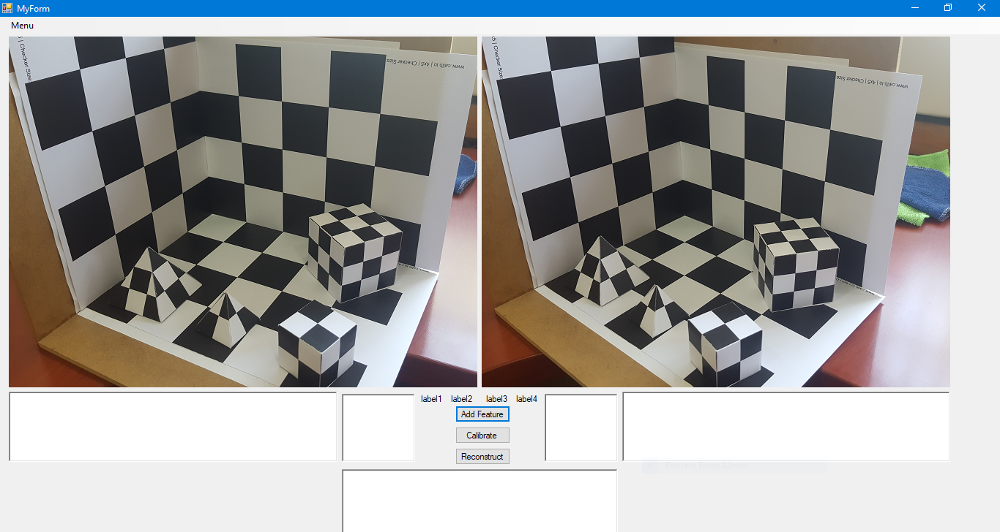
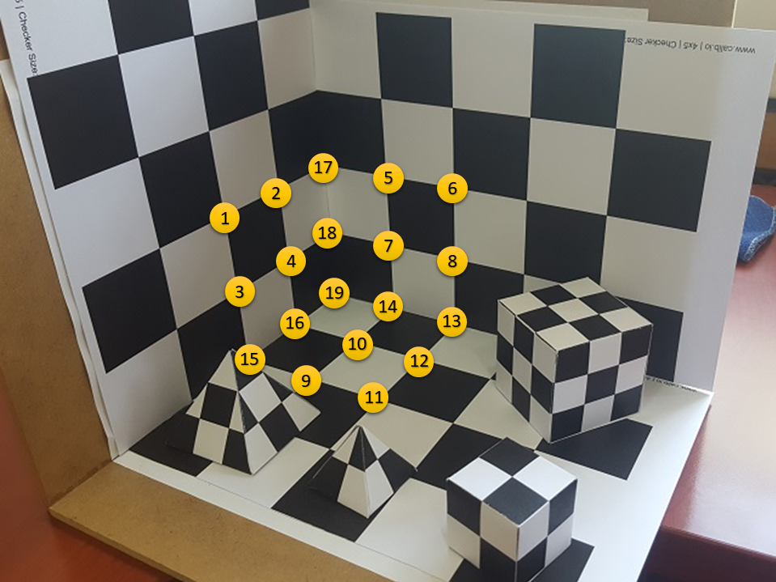
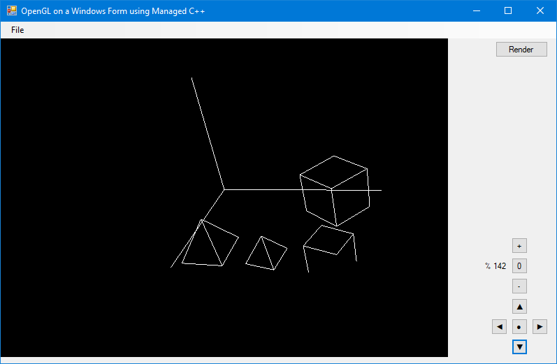

# Stereo-Camera-Calibration-and-3D-Recovery
Implementation and demonstration of calibration and reconstruction.

Implementation can be found in calibration.h

Selected calibration points for demo

Demo representation of 3D recovered data

